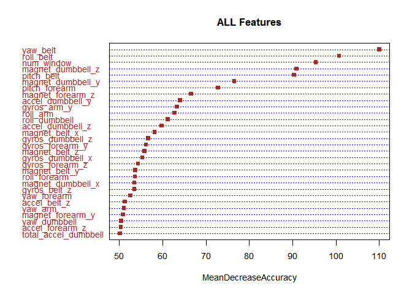

# Practical Machine Learning Project
November 17, 2015  

Objective
---
The purpose of this project is to predict the exercise in which the person performed (the classe variable) using machine learning algorithms after sufficient data preparation.

Data 
----

The training data for this project are available here: 
https://d396qusza40orc.cloudfront.net/predmachlearn/pml-training.csv

The test data are available here: 
https://d396qusza40orc.cloudfront.net/predmachlearn/pml-testing.csv

The data for this project come from this source: http://groupware.les.inf.puc-rio.br/har. 

Data Preparation
----

First, import the data in after saving the files to your working directory. 

```r
library("caret")
```

```
## Loading required package: lattice
## Loading required package: ggplot2
```

```r
library(rpart)
library(RWeka)
```


```r
train<-read.csv("pml-training.csv",h=T)
test<-read.csv("pml-testing.csv",h=T)
```

Next, there are a lot of variables with either missing values or mostly NAs. 
We want to remove those variables as there's not a lot of information to be gleaned from them. 
We also want to change the variable new_window to numeric.


```r
##change the blanks to NA
train[train==""]<-NA
##only keep data with less than 10% blank/NA
newtrain<-train[colSums(is.na(train))/dim(train)[1]<.1]
#remove features with unqiue values
newtrain2<-newtrain[,-c(1:5)]
newtrain2$new_window<-as.numeric(newtrain2$new_window)
```

Once we have our condensed data set, we partition it into a 60/40 split for training and testing. 


```r
set.seed(30)
trainIndex = createDataPartition(newtrain2$classe, p = 0.60,list=FALSE)
training = newtrain2[trainIndex,]
testing = newtrain2[-trainIndex,]
```

For the first machine learning algorithm, try the J48 decision tree. 


```r
##J48 on cleaned data
set.seed(30)
model1<-J48(factor(training[,55])~.,data=training[,-55])
model1cv<-evaluate_Weka_classifier(model1,numFolds = 10)
#summary(model1)
#model1cv
datanames<-names(training[,-55])

results<-predict(model1,newdata=testing)
C1 <- confusionMatrix(results, testing$classe)
print(C1)
```

```
## Confusion Matrix and Statistics
## 
##           Reference
## Prediction    A    B    C    D    E
##          A 2219   16    0    3    1
##          B    5 1477   20    6    2
##          C    1    7 1333    9    0
##          D    5    4   13 1263    9
##          E    2   14    2    5 1430
## 
## Overall Statistics
##                                           
##                Accuracy : 0.9842          
##                  95% CI : (0.9812, 0.9868)
##     No Information Rate : 0.2845          
##     P-Value [Acc > NIR] : < 2.2e-16       
##                                           
##                   Kappa : 0.98            
##  Mcnemar's Test P-Value : 0.002489        
## 
## Statistics by Class:
## 
##                      Class: A Class: B Class: C Class: D Class: E
## Sensitivity            0.9942   0.9730   0.9744   0.9821   0.9917
## Specificity            0.9964   0.9948   0.9974   0.9953   0.9964
## Pos Pred Value         0.9911   0.9781   0.9874   0.9760   0.9842
## Neg Pred Value         0.9977   0.9935   0.9946   0.9965   0.9981
## Prevalence             0.2845   0.1935   0.1744   0.1639   0.1838
## Detection Rate         0.2828   0.1882   0.1699   0.1610   0.1823
## Detection Prevalence   0.2854   0.1925   0.1721   0.1649   0.1852
## Balanced Accuracy      0.9953   0.9839   0.9859   0.9887   0.9940
```

The J48 returns an accuracy of 99.57% on the training data set with no cross-validation. The accuracy reduces down to 97.51% with 10-fold cross-validation and also has 98.42% accuracy on the test data set. 

Next, Principle Component Analysis is completed on the data set to see if model accuracy improves. 

The first thing to do is make the variables numeric and run PCA on them.

```r
trainingNum <- training
testingNum <- testing
#Making things numeric
for ( i in 2:(ncol(training)-1))
{
  trainingNum[,i]<-as.numeric(as.character(training[,i]))
}

for ( i in 2:(ncol(testing)-1))
{
  testingNum[,i]<-as.numeric(as.character(testing[,i]))
}
pca1<-prcomp(trainingNum[,-55])
summary(pca1)
```

```
## Importance of components:
##                           PC1      PC2      PC3      PC4      PC5
## Standard deviation     598.39 537.1710 477.8863 384.7205 357.8350
## Proportion of Variance   0.25   0.2015   0.1595   0.1033   0.0894
## Cumulative Proportion    0.25   0.4515   0.6109   0.7142   0.8036
##                              PC6       PC7       PC8      PC9      PC10
## Standard deviation     256.09170 234.98077 198.41561 173.4441 158.13420
## Proportion of Variance   0.04579   0.03855   0.02749   0.0210   0.01746
## Cumulative Proportion    0.84943   0.88798   0.91547   0.9365   0.95393
##                             PC11     PC12     PC13     PC14     PC15
## Standard deviation     118.22934 95.55754 89.12707 76.17094 68.54112
## Proportion of Variance   0.00976  0.00638  0.00555  0.00405  0.00328
## Cumulative Proportion    0.96369  0.97007  0.97561  0.97966  0.98294
##                            PC16     PC17    PC18     PC19     PC20    PC21
## Standard deviation     62.79884 56.75421 53.5815 49.95501 48.39555 41.3926
## Proportion of Variance  0.00275  0.00225  0.0020  0.00174  0.00164  0.0012
## Cumulative Proportion   0.98570  0.98795  0.9899  0.99169  0.99333  0.9945
##                           PC22     PC23     PC24     PC25     PC26
## Standard deviation     37.8546 35.23588 33.01079 30.87856 25.65592
## Proportion of Variance  0.0010  0.00087  0.00076  0.00067  0.00046
## Cumulative Proportion   0.9955  0.99639  0.99715  0.99782  0.99828
##                            PC27     PC28     PC29    PC30     PC31
## Standard deviation     23.28528 21.59913 20.25786 17.0145 15.07609
## Proportion of Variance  0.00038  0.00033  0.00029  0.0002  0.00016
## Cumulative Proportion   0.99866  0.99898  0.99927  0.9995  0.99963
##                            PC32    PC33    PC34    PC35    PC36    PC37
## Standard deviation     13.88484 9.85763 7.62669 7.22886 6.64107 6.14558
## Proportion of Variance  0.00013 0.00007 0.00004 0.00004 0.00003 0.00003
## Cumulative Proportion   0.99976 0.99983 0.99987 0.99991 0.99994 0.99997
##                           PC38    PC39    PC40  PC41  PC42  PC43   PC44
## Standard deviation     3.76320 3.54436 3.35749 2.115 1.935 1.095 0.5088
## Proportion of Variance 0.00001 0.00001 0.00001 0.000 0.000 0.000 0.0000
## Cumulative Proportion  0.99998 0.99998 0.99999 1.000 1.000 1.000 1.0000
##                          PC45   PC46   PC47  PC48   PC49   PC50   PC51
## Standard deviation     0.4107 0.3576 0.3193 0.307 0.2402 0.1957 0.1863
## Proportion of Variance 0.0000 0.0000 0.0000 0.000 0.0000 0.0000 0.0000
## Cumulative Proportion  1.0000 1.0000 1.0000 1.000 1.0000 1.0000 1.0000
##                          PC52   PC53    PC54
## Standard deviation     0.1462 0.1046 0.03703
## Proportion of Variance 0.0000 0.0000 0.00000
## Cumulative Proportion  1.0000 1.0000 1.00000
```

We will chose enough PCAs to have at least 98% of the variance included, which means keeping the 1st 15 PCAs and merge it with the classe variable to build the PCA model. We also need to apply the PCAs to the test set to test the PCA model. 


```r
pca2<-predict(pca1,newdata=testingNum)

newpcadata<-data.frame(pca1$x[,1:15])
newdata<-cbind(newpcadata,training[,"classe"])
newdata<-as.data.frame(newdata)
```

Next, build a J48 decision tree using the first 15 PCAs, run cross-validation, and then apply to the PCA test set. 


```r
##PCA j48
set.seed(30)
model2<-J48(factor(newdata[,16])~.,data=newdata[,-16],control = Weka_control(R=T))
#,control = Weka_control(C=.25,M=3) # add parameters
model2cv<-evaluate_Weka_classifier(model2,numFolds = 10)

pcaresults<-predict(model2,newdata=data.frame(pca2[,1:15]))
C2 <- confusionMatrix(pcaresults, testing$classe)
print(C2)
```

```
## Confusion Matrix and Statistics
## 
##           Reference
## Prediction    A    B    C    D    E
##          A 2031   88   48   37   59
##          B   64 1241  103   75   82
##          C   40   53 1060  108   51
##          D   53   78  104  967   81
##          E   44   58   53   99 1169
## 
## Overall Statistics
##                                           
##                Accuracy : 0.8244          
##                  95% CI : (0.8158, 0.8327)
##     No Information Rate : 0.2845          
##     P-Value [Acc > NIR] : < 2.2e-16       
##                                           
##                   Kappa : 0.7777          
##  Mcnemar's Test P-Value : 0.0004564       
## 
## Statistics by Class:
## 
##                      Class: A Class: B Class: C Class: D Class: E
## Sensitivity            0.9099   0.8175   0.7749   0.7519   0.8107
## Specificity            0.9587   0.9488   0.9611   0.9518   0.9603
## Pos Pred Value         0.8975   0.7930   0.8079   0.7537   0.8215
## Neg Pred Value         0.9640   0.9559   0.9529   0.9514   0.9575
## Prevalence             0.2845   0.1935   0.1744   0.1639   0.1838
## Detection Rate         0.2589   0.1582   0.1351   0.1232   0.1490
## Detection Prevalence   0.2884   0.1995   0.1672   0.1635   0.1814
## Balanced Accuracy      0.9343   0.8832   0.8680   0.8519   0.8855
```

The PCA J48 returns an accuracy of 91.58% on the training data set with no cross-validation. The accuracy reduces down to 80.92% with 10-fold cross-validation and also has 82.44% accuracy on the test data set. 

Next, try Random Forest. 


```r
library(randomForest)
```

```
## randomForest 4.6-12
## Type rfNews() to see new features/changes/bug fixes.
```

```r
set.seed(30)
model3 <-randomForest(factor(training[,55])~.,data=training[,-55],importance=TRUE,ntree=2000)
```

The Features plot shows the most important features using the Mean Decrease Accuracy. 

```r
varImpPlot(model3,cex = 0.9, pch = 15,color = "brown", lcolor = "blue",bg="black",type=1,main="ALL Features")
```

 

Next, predict against the test data set to determine the accuracy.

```r
RFresults<-predict(model3,newdata=testing)
C3 <- confusionMatrix(RFresults, testing$classe)
print(C3)
```

```
## Confusion Matrix and Statistics
## 
##           Reference
## Prediction    A    B    C    D    E
##          A 2232    9    0    0    0
##          B    0 1508    3    0    0
##          C    0    1 1365    9    0
##          D    0    0    0 1276    4
##          E    0    0    0    1 1438
## 
## Overall Statistics
##                                          
##                Accuracy : 0.9966         
##                  95% CI : (0.995, 0.9977)
##     No Information Rate : 0.2845         
##     P-Value [Acc > NIR] : < 2.2e-16      
##                                          
##                   Kappa : 0.9956         
##  Mcnemar's Test P-Value : NA             
## 
## Statistics by Class:
## 
##                      Class: A Class: B Class: C Class: D Class: E
## Sensitivity            1.0000   0.9934   0.9978   0.9922   0.9972
## Specificity            0.9984   0.9995   0.9985   0.9994   0.9998
## Pos Pred Value         0.9960   0.9980   0.9927   0.9969   0.9993
## Neg Pred Value         1.0000   0.9984   0.9995   0.9985   0.9994
## Prevalence             0.2845   0.1935   0.1744   0.1639   0.1838
## Detection Rate         0.2845   0.1922   0.1740   0.1626   0.1833
## Detection Prevalence   0.2856   0.1926   0.1752   0.1631   0.1834
## Balanced Accuracy      0.9992   0.9965   0.9981   0.9958   0.9985
```

The Random Forest model returns an accuracy of 99.66% accuracy on the test data set. 

Out of Sample Error
---

For each model, compare the accuracy on the test set and calculate the Out of Sample Error.

Model | Accuracy on Test Set | Out of Sample Error
----- | ----- | ------ 
J48 Model | 0.9841958 | 0.0158042
PCA J48 Model | 0.8243691 | 0.1756309
Random Forest Model | 0.9965588 |0.0034412

The RF Model had the lowest Out of Sample Error of 0.0034412, therefore we will predict the supplied test set with the RF model. 

First, prep the test data set to include the same columns as the prepped training set, then apply the Random Forest model, and then output the predictions into individual files. 


```r
test2<-test[,datanames]
test2$new_window<-as.numeric(test2$new_window)
results3<-predict(model3,newdata=test2)

pml_write_files = function(x){
  n = length(x)
  for(i in 1:n){
    filename = paste0("problem_id_",i,".txt")
    write.table(x[i],file=filename,quote=FALSE,row.names=FALSE,col.names=FALSE)
  }
}

pml_write_files(results3)
```

The predictions on the test set provided were:

```
##  1  2  3  4  5  6  7  8  9 10 11 12 13 14 15 16 17 18 19 20 
##  B  A  B  A  A  E  D  B  A  A  B  C  B  A  E  E  A  B  B  B 
## Levels: A B C D E
```

They were submitted and were all correct. 
